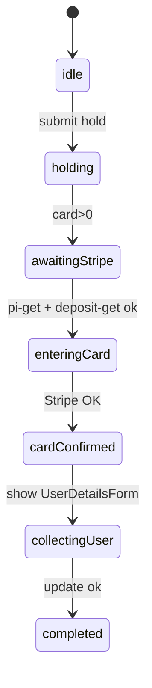

# Development Plan: Stripe Booking Flow Realignment

## 1. Project Objective
Build a React-based developer tool that visualises and **tests the new Eveve → Stripe flow** where the Stripe Payment / Setup Intent is created *immediately after a successful `hold`* and **before** the customer enters personal details (`update`).  
The app will:
* Fetch and display every request/response in real-time.
* Allow manual re-play of individual steps.
* Validate both “deposit” (`card = 2`) and “no-show” (`card = 1`) scenarios.
* Surface failures early so the booking can gracefully expire (3 min hold timeout).

---

## 2. Tech Stack
| Layer                | Choice                          | Notes |
|----------------------|---------------------------------|-------|
| Front-end framework  | React 18 (Vite template)        | Fast HMR & simple build |
| Styling              | Tailwind CSS                    | Utility-first, zero config |
| HTTP client          | Axios (wrapped in custom hook)  | Interceptors for logging |
| State management     | React Context + Hooks           | Lightweight, no Redux |
| Payments UI          | Stripe JS + Elements            | Loads after `pi-get` |
| Tooling              | ESLint / Prettier (optional)    | Consistent code style |

---

## 3. Project Setup

```bash
# 1. scaffold
npm create vite@latest stripe-booking-form-test -- --template react
cd stripe-booking-form-test

# 2. deps
npm install
npm install axios stripe @stripe/react-stripe-js
npm install -D tailwindcss postcss autoprefixer
npx tailwindcss init -p
```

Tailwind: add `./src/**/*.{js,jsx}` to `content` array and import the base styles in `src/index.css`.

---

## 4. Application Architecture

### 4.1 Component Tree
```
<App>
 ├─ <Header/>
 ├─ <MainPanel>
 │    ├─ <BookingForm/>        ← input HOLD URL
 │    ├─ {cardRequired && <StripePaymentForm/>}
 │    └─ <UserDetailsForm/>    ← optional, appears after Stripe success
 └─ <LogDisplay/>              ← live JSON console
```

### 4.2 Core Files
| File / Dir               | Responsibility |
|--------------------------|----------------|
| `src/api/eveve.js`       | Wrap Eveve endpoints (`hold`, `pi-get`, `deposit-get`, `update`, `restore`, `pm-id`) |
| `src/api/stripe.js`      | Helper to confirm intents via Stripe SDK |
| `src/context/FlowCtx.js` | Global state: booking, stripe keys, logs |
| `src/hooks/useLogger.js` | Push structured logs to context |
| `src/components/*`       | UI pieces outlined above |

---

## 5. Re-Ordered Flow Implementation

| # | Action | Endpoint | UI Component | Notes |
|---|--------|----------|--------------|-------|
| 1 | HOLD booking | `/web/hold` | BookingForm | parse `card`, `uid`, `created` |
| 2 | If `card>0` → fetch Stripe keys | `/int/pi-get` | *auto* | store `client_secret`, `public_key`, `cust` |
| 3 | Determine charge or hold | `/int/deposit-get` | *auto* | read `code` (1 vs 2) & amounts |
| 4 | Render Stripe Elements | — | StripePaymentForm | initialise with `public_key` & `client_secret` |
| 5 | User submits card → Stripe confirm | Stripe JS `confirm{Setup,Payment}Intent` | StripePaymentForm | handle result, log outcome |
| 6 | After Stripe **success** show personal-details form | `UserDetailsForm` | collect name/phone/email |
| 7 | Send `update` to Eveve | `/web/update` | UserDetailsForm | finalises booking |
| 8 | Optionally attach PM | `/int/pm-id` | *auto* | only for setup_intent / no-show |
| 9 | Display final success state | — | LogDisplay / Toast |

Failure handling:  
• Stripe fail ⇒ show error, allow retry, booking expires after 3 min.  
• `deposit-get` code mismatch ⇒ surface to developer.

---

## 6. State Management



`FlowCtx` value shape:
```ts
{
  booking: { uid, created, card, perHead, ... } | null,
  stripe:  { clientSecret, publicKey, cust, paymentType }, // paymentType: 'deposit'|'noshow'
  logs:    ApiLog[], // { ts, label, request, response, error? }
}
```

---

## 7. API Layer Guidelines

```ts
// eveve.js (excerpt)
export const hold = params => axios.get(base + '/web/hold', { params });
export const piGet = params => axios.get(base + '/int/pi-get', { params });
export const depositGet = params => axios.get(base + '/int/deposit-get', { params });
...
```

Axios interceptor:

```ts
axiosInstance.interceptors.response.use(
  res => { addLog(res.config, res.data); return res; },
  err => { addLog(err.config, err.response?.data, err); return Promise.reject(err); }
);
```

This ensures every call is captured without duplicating logging code.

---

## 8. Development & Testing Phases

| Phase | Objectives | Deliverables |
|-------|------------|--------------|
| 1. Skeleton UI | Render BookingForm & LogDisplay, implement `/hold` | Visible hold response |
| 2. Stripe Pre-flow | Auto-call `pi-get`, `deposit-get`, show keys in log | Keys retrieved before user details |
| 3. Card Capture | Integrate Stripe Elements, confirm intent | Successful mock payments |
| 4. Finalise Booking | Build UserDetailsForm + `/update`, `/pm-id` | End-to-end green path |
| 5. Edge Cases | Simulate failed card, expired hold, missing keys | Robust error screens |
| 6. Polish | Tailwind UI tidy, copyable cURL in logs | Developer-friendly tool |

Unit tests (optional) using Vitest for helper functions; e2e flows can be manual due to external APIs.

---

## 9. Logging & Developer UX

* JSON viewer with collapsible nodes (use `react-json-view`).
* Colour-coded badges: GET 200, GET 4xx, Stripe success/error.
* Copy-to-clipboard for any request/response block.
* Timer countdown (3 min) to illustrate hold expiry.

---

## 10. Future Enhancements

1. WebSocket listener for `wss://…/notifications` to observe server pushes.  
2. Export log history as HAR or JSON file.  
3. Parameterised load test (loop through covers/date permutations).  
4. Toggle between test & live Stripe keys via env variables.

---

## 11. Risks & Mitigations

| Risk | Impact | Mitigation |
|------|--------|-----------|
| Eveve sandbox instability | Blocks testing | Cache sample responses as fallback |
| Mixed live/test Stripe keys | Payment errors | Enforce `pk_test_` prefix in UI |
| CORS restrictions | Calls fail in browser | Use local proxy or serverless relay if needed |

---

## 12. Timeline (rough)

*Week 1:* Phase 1-2  
*Week 2:* Phase 3-4  
*Week 3:* Edge cases, polish, docs  

Total ≈ **3 weeks** part-time developer effort.

---

## 13. Deliverables Checklist

- [ ] Vite + React project with Tailwind configured  
- [ ] Core components & context  
- [ ] Centralised Eveve/Stripe API module with logging  
- [ ] Re-ordered flow operational (deposit & no-show)  
- [ ] JSON log viewer with copy feature  
- [ ] README update with usage instructions  

When the above checklist is ticked, hand off to QA or the autonomous coding droid for iteration.
